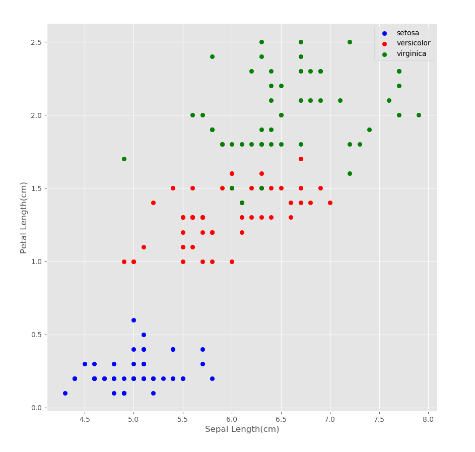
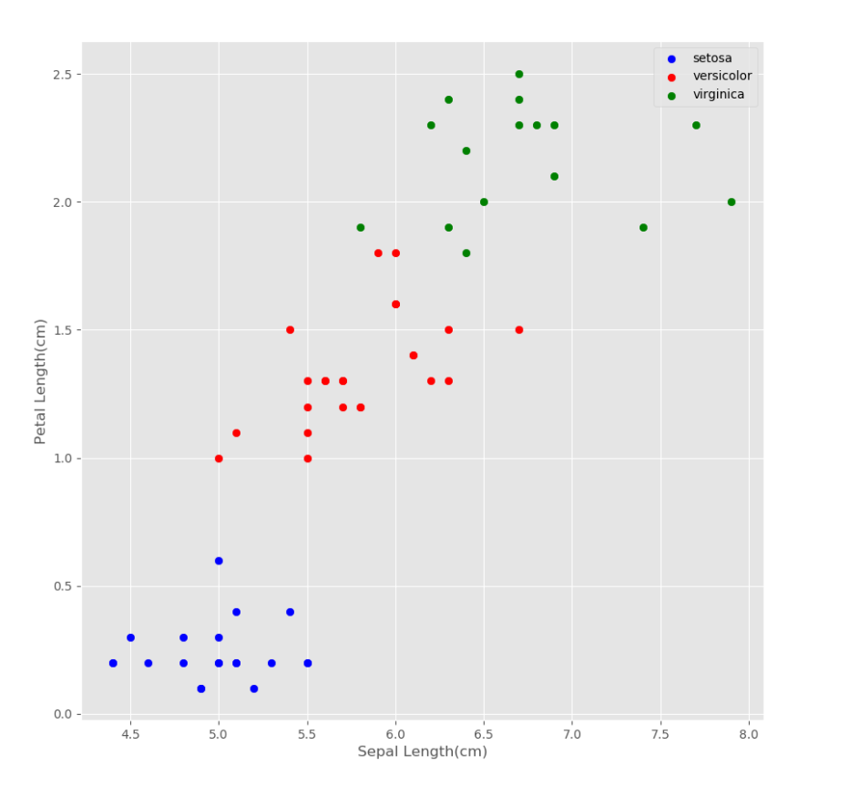

# k-NN Classifier Implementation

In this program, k-NN classification algorithm were implemented and tested by using the Iris dataset. k-NN classification algorithm
implementation has two important input parameters which are number
of neighbours and distance metrics.

# Dataset

Iris dataset contains three flowers and each flower is represented by four features:

  - 1 = **Sepal Length**
  - 2 = **Sepal Width**
  - 3 = **Petal Length**
  - 4 = **Petal Width**

>   In this implementation, first and fourth features were used. The iris data imported as a csv file.

### Three flowers in the Iris dataset: Iris Versicolor, Iris Virginica and Iris Setosa.

# Training and Test Sets

> In the iris dataset, each flower has 50 samples. In this implementation, 30 samples were put from each flower class into the training set and the rest of the samples were put into the test set.

### This plot represents a scatter plot which is the actual data points.

# Predictions

### This plot represents a scatter plot which is the predicted data points.

> The given code (iris.py) has all the explanations and plots. 
> The given Jupyter notebook (IrisDataset.ipynb) presents a quick demo at the last cells.
> In the report.pdf there are detail explanations about the implementation. 
